# Фінальний проєкт

## 1. Завантаження даних 
### Створіть схему pandemic у базі даних за допомогою SQL-команди.
```
CREATE SCHEMA IF NOT EXISTS pandemic;
```
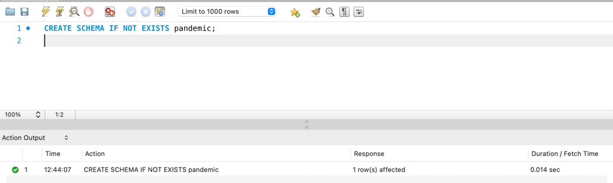

### Оберіть її як схему за замовчуванням за допомогою SQL-команди.
```
USE pandemic;
```
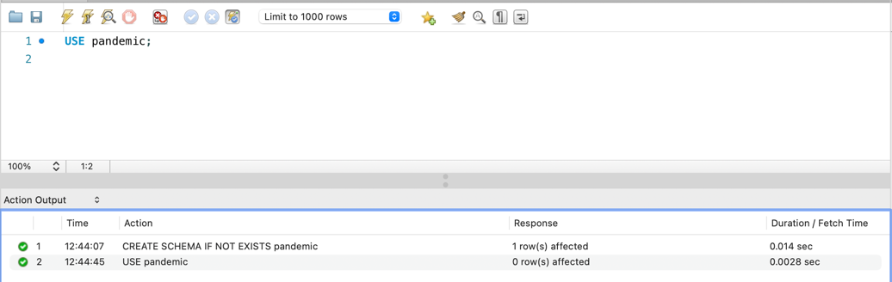

### Імпортуйте дані за допомогою Import wizard так, як ви вже робили це у темі 3.
Демонстрація кількості завантажених даних
```
SELECT COUNT(*) FROM infectious_cases
```
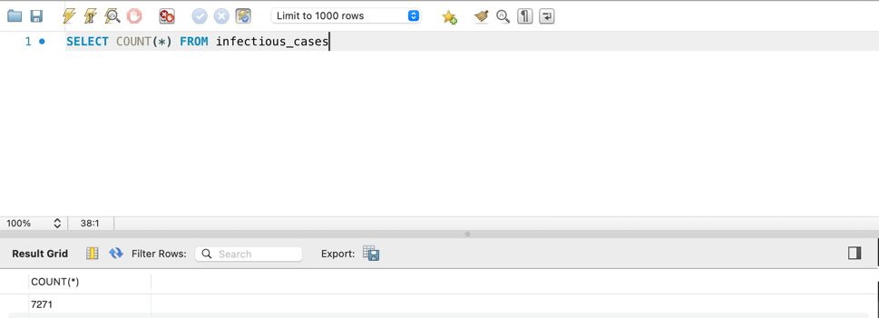
---

## 2. Нормалізуйте таблицю infectious_cases до 3-ї нормальної форми. Збережіть у цій же схемі дві таблиці з нормалізованими даними.
### Створюємо таблицю `countries` 
```
CREATE TABLE IF NOT EXISTS countries (
    id INT PRIMARY KEY AUTO_INCREMENT,
    country VARCHAR(45) NOT NULL,
    code VARCHAR(8),
    UNIQUE (country, code)
);
```

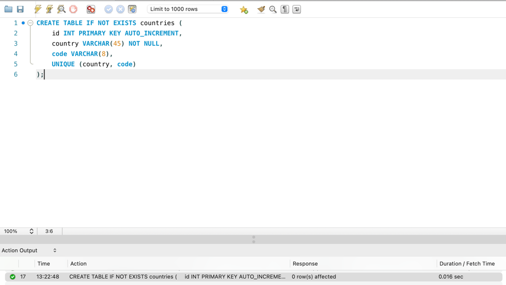

### Створюємо таблицю `infectious`
```
CREATE TABLE IF NOT EXISTS infectious (
    id INT PRIMARY KEY AUTO_INCREMENT,
    country_id INT NOT NULL,
    year YEAR NOT NULL,
    number_yaws FLOAT,
    polio_cases FLOAT,
    cases_guinea_worm FLOAT,
    number_rabies FLOAT,
    number_malaria FLOAT,
    number_hiv FLOAT,
    number_tuberculosis FLOAT,
    number_smallpox FLOAT,
    number_cholera_cases FLOAT,
    UNIQUE (country_id, year),
    FOREIGN KEY (country_id) REFERENCES countries(id) ON DELETE CASCADE
);
```
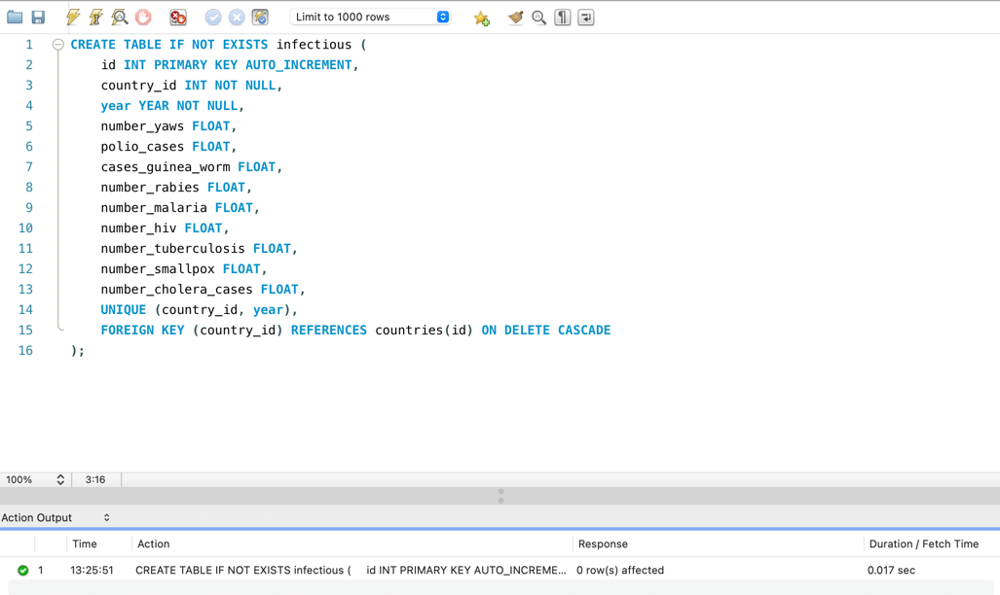

### Заповнюємо таблицю `countries`
```
INSERT INTO countries (country, code)
SELECT DISTINCT Entity, Code
FROM infectious_cases
WHERE Entity IS NOT NULL;
```
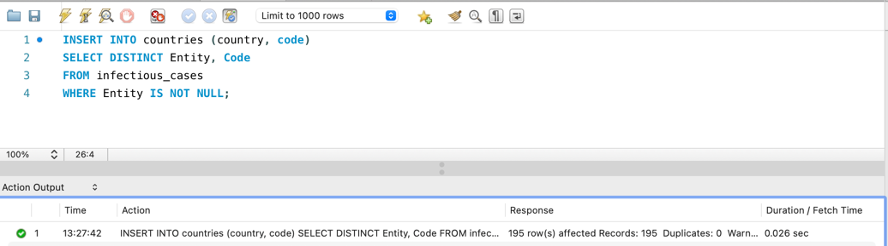

### Заповнюємо таблицю `infectious`
```
INSERT INTO infectious (
    country_id,
    year,
    number_yaws,
    polio_cases,
    cases_guinea_worm,
    number_rabies,
    number_malaria,
    number_hiv,
    number_tuberculosis,
    number_smallpox,
    number_cholera_cases
)
SELECT c.id,
       ic.Year,
       NULLIF(ic.Number_yaws, ''),
       NULLIF(ic.polio_cases, ''),
       NULLIF(ic.cases_guinea_worm, ''),
       NULLIF(ic.Number_rabies, ''),
       NULLIF(ic.Number_malaria, ''),
       NULLIF(ic.Number_hiv, ''),
       NULLIF(ic.Number_tuberculosis, ''),
       NULLIF(ic.Number_smallpox, ''),
       NULLIF(ic.Number_cholera_cases, '')
FROM infectious_cases ic
JOIN countries c ON ic.Entity = c.country AND ic.Code <=> c.code;
```
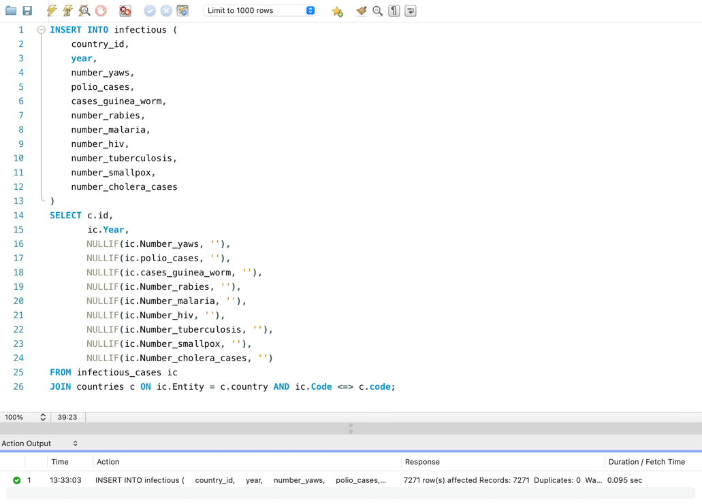

### Кількість записів в `infectious`
```
SELECT COUNT(*) AS total_in_infectious
FROM infectious;
```
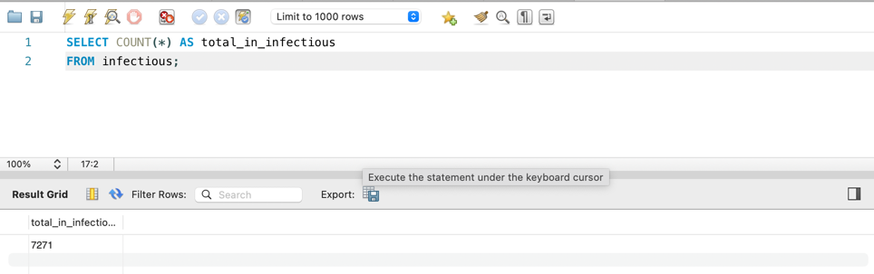
---

## 3. Проаналізуйте дані
- Для кожної унікальної комбінації Entity та Code або їх id порахуйте середнє, мінімальне, максимальне значення та суму
для атрибута Number_rabies.
- Результат відсортуйте за порахованим середнім значенням у порядку спадання.
- Оберіть тільки 10 рядків для виведення на екран.

```
SELECT 
    c.country, 
    c.code, 
    MIN(i.number_rabies) AS min_number_rabies, 
    MAX(i.number_rabies) AS max_number_rabies, 
    ROUND(AVG(i.number_rabies), 3) AS average_number_rabies, 
    ROUND(SUM(i.number_rabies), 3) AS total_number_rabies
FROM infectious i
JOIN countries c ON i.country_id = c.id
WHERE i.number_rabies IS NOT NULL
GROUP BY c.country, c.code
ORDER BY average_number_rabies DESC
LIMIT 10;
```
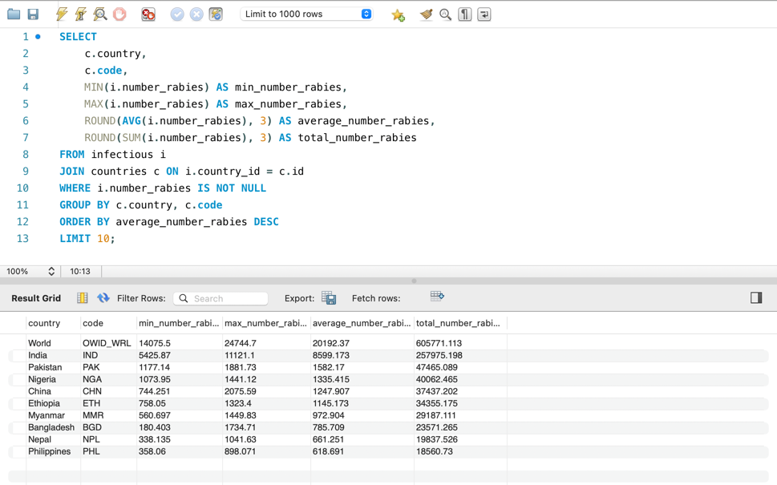

---

## 4. Побудуйте колонку різниці в роках
Для оригінальної або нормованої таблиці для колонки Year побудуйте з використанням вбудованих SQL-функцій:
- атрибут, що створює дату першого січня відповідного року
- атрибут, що дорівнює поточній даті
- атрибут, що дорівнює різниці в роках двох вищезгаданих колонок
```
SELECT 
    id, 
    year, 
    DATE_FORMAT(CONCAT(year, '-01-01'), '%Y-%m-%d') AS start_date, 
    DATE(NOW()) AS now, 
    YEAR(NOW()) - year AS years_passed
FROM infectious;
```
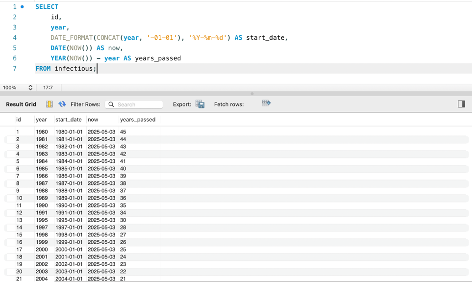

---

## 5. Побудуйте власну функцію
Створіть і використайте функцію, що будує такий же атрибут, як і в попередньому завданні: функція має приймати на вхід
значення року, а повертати різницю в роках між поточною датою та датою, створеною з атрибута року (1996 рік → ‘1996-01-01’).
```
DROP FUNCTION IF EXISTS YearsDiff;
DELIMITER //
CREATE FUNCTION YearsDiff(start_year YEAR)
RETURNS INT
DETERMINISTIC
BEGIN
    RETURN TIMESTAMPDIFF(YEAR, STR_TO_DATE(CONCAT(start_year, '-01-01'), '%Y-%m-%d'), CURDATE());
END //
DELIMITER ;

SELECT id,
       year,
       YearsDiff(year) AS years_diff
FROM infectious;
```
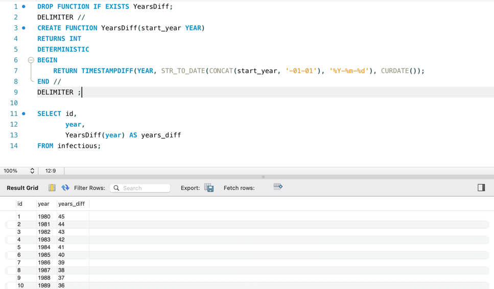
